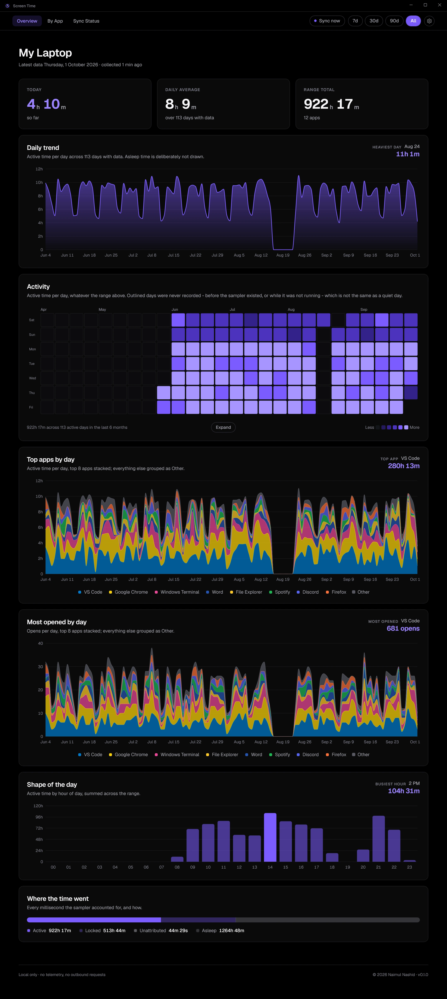
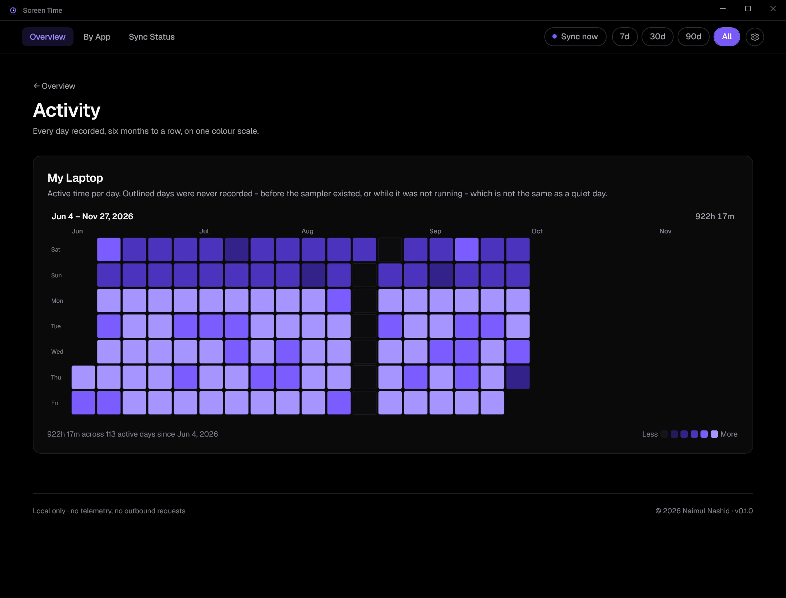
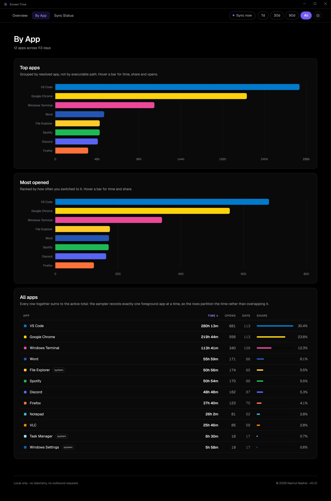
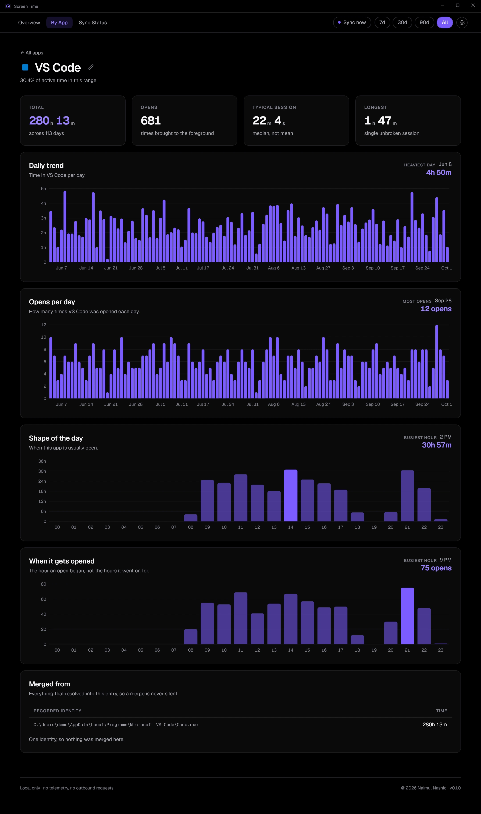
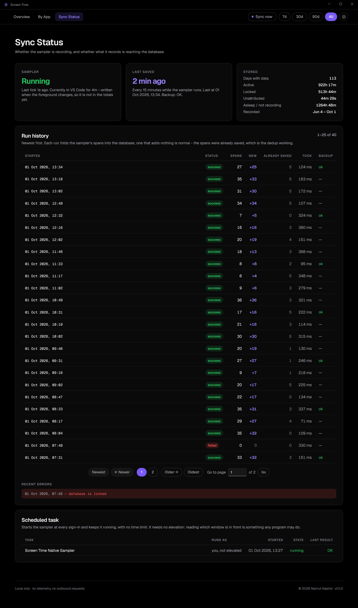

# Screen Time (native)

[](https://github.com/naimulnashid/screen-time-native/actions/workflows/ci.yml)
[](https://github.com/naimulnashid/screen-time-native/releases/latest)
[](LICENSE)

A native Windows app that keeps a **permanent history of which app you were
using on this PC, and for how long**. Windows keeps no lasting record of it,
and a Windows reset would erase one if it did. This app records the
foreground window every two seconds into a database on another drive, so the
history survives.

Built with WinUI 3 on .NET 10. A native port of the laptop side of the
[Screen Time Dashboard](https://github.com/naimulnashid/screen-time-tracker)
web app, sharing its design and its rules but no code. Local only: no network
calls, no server, no account. **It never records window titles** - which app,
and for how long, nothing more.

## What it shows

- **Overview**: today (or the latest day), the daily average over days with
  data, and the range total; the daily trend; a six-month activity heat map
  (Expand for the full history); the top apps by day and the most opened by
  day; the shape of the day by hour; and **where the time went** - active,
  locked, unattributed, asleep.
- **By App**: the top apps by time and by opens, and every app with its time,
  opens, days and share. Apps with a minute or more open a detail page: time
  and opens per day and per hour, the typical and the longest session, and
  every recorded path merged into the app.
- **Sync Status**: whether the sampler is recording right now, the run
  history, and the scheduled task as Windows reports it.

Range chips (7d / 30d / 90d / All) apply to every page.

An **open** is a visit, not a focus event: alt-tabbing away and straight back
is one open, and leaving for another app and returning is two.

## Screenshots

Every page, top to bottom, on an invented history (`screentime demo-data`) -
nobody's real usage.

<details open>
<summary><b>Overview</b> - today, trend, activity, top and most opened apps by day, shape of the day, where the time went</summary>



</details>

<details>
<summary><b>Activity</b> - the full history as a heat map, in 26-week blocks</summary>



</details>

<details>
<summary><b>By App</b> - top apps, most opened, and every app with its share</summary>



</details>

<details>
<summary><b>App detail</b> - time and opens per day and per hour, sessions, merged paths</summary>



</details>

<details>
<summary><b>Sync Status</b> - the sampler, the run history, and its task</summary>



</details>

## Install

Windows 10 (version 2004 or later) or Windows 11, x64.

**From a release** (nothing else to install): download
`ScreenTime-<version>-win-x64.zip` from
[Releases](https://github.com/naimulnashid/screen-time-native/releases), extract
it, and in that folder run:

```powershell
powershell -ExecutionPolicy Bypass -File .\Install.ps1
```

**From source**: needs the [.NET 10 SDK](https://dotnet.microsoft.com/download).
In a clone:

```powershell
powershell -ExecutionPolicy Bypass -File tools\Install.ps1
```

Either way it installs a self-contained build to `%LOCALAPPDATA%\Programs\Screen Time`,
adds **Screen Time** to the Start menu and to **Settings → Apps → Installed
apps**, sets the data folder (`-DataDir`, default
`D:\PersistentData\screen-time-native`; with no `D:` drive the app asks on
first run), registers the sign-in task and starts recording. **No
administrator approval is needed at any step.**

**Keep the data folder off the Windows drive**, ideally in a folder a cloud
client backs up: that is what makes the history survive a reset.

**Uninstall** from Installed apps, or `Install.ps1 -Uninstall`. Your history
is never deleted.

**After a Windows reset**, reinstall with `-DataDir` pointing at the same
folder. Everything recorded before the reset is still there.

## How recording works

- **Screen Time Native Sampler** starts at every sign-in, as you, unelevated
  and without a window. Every two seconds it asks Windows which window is in
  front and whether the session is locked, and writes each span to a small
  file when the foreground changes. Every 15 minutes it saves those spans into
  the database and, at most hourly, writes a backup beside it.
- **A sleep is not usage.** When the clock jumps (the PC slept), the span
  ends at the last sample and the sleep is recorded as such. If the sampler is
  killed - Windows signs out before hibernating - the next start recovers its
  last span from its heartbeat.
- **Locked is not active.** The lock screen counts as locked, never as an app;
  a moment with no foreground window at all is shown as unattributed rather
  than guessed at.
- Store apps all run inside one host process; the sampler looks past it to the
  app itself, and flags the rare case it cannot.

## Using it

- **Zoom** like a browser: **Ctrl+Plus**, **Ctrl+Minus**, **Ctrl+mouse wheel**,
  **Ctrl+0** to reset (50 % to 200 %, remembered). Also in the settings menu.
- **Sync now** (top bar or tray) saves what the sampler has recorded straight
  away, instead of at its next quarter hour.
- **Tray**: closing the window keeps the app in the notification area, with
  today's time in its tooltip. Right-click it for Sync now, the options and Exit.
  Recording does not depend on it.
- **Notifications** when recording stops or a save fails (settings or tray).
- **Start at login**: settings menu or tray. It starts straight to the tray.
- **Rename an app, or change its colour**: the pencil beside its name (hover a
  table row). Pick a colour or type its hex code; "Default colour" goes back.
  Both are stored with the history.
- **Logos**: in the same pencil menu choose **Set logo…**, or drop an image on
  the app's name. Files live in the data folder's `logos\`, named after the
  app (`VS Code.svg`); dropping files there works too.
- **Light or dark**: Settings > Theme, or follow Windows' setting.
- **Click a Top apps bar** to open that app's page.
- **This PC…** in the settings menu sets the name on the overview.

The app always opens maximised.

## Development

```powershell
dotnet build ScreenTimeNative.slnx
dotnet test --project tests\ScreenTime.Core.Tests\ScreenTime.Core.Tests.csproj
dotnet run --project src\ScreenTime.Cli -- status          # is the sampler recording?
dotnet run --project src\ScreenTime.Cli -- stats --days 7  # totals and top apps
dotnet run --project src\ScreenTime.Cli -- sample --out $env:TEMP\st --seconds 30   # a test run beside the real one
dotnet run --project src\ScreenTime.Cli -- demo-data demo-data   # an invented history
& tools\Capture-Views.ps1 -Views 'overview=overview,0' -FullPage 1440
```

## License

[MIT](LICENSE). Geist is © Vercel, under the SIL Open Font License
(`src/ScreenTime.App/Assets/Fonts/OFL.txt`).
